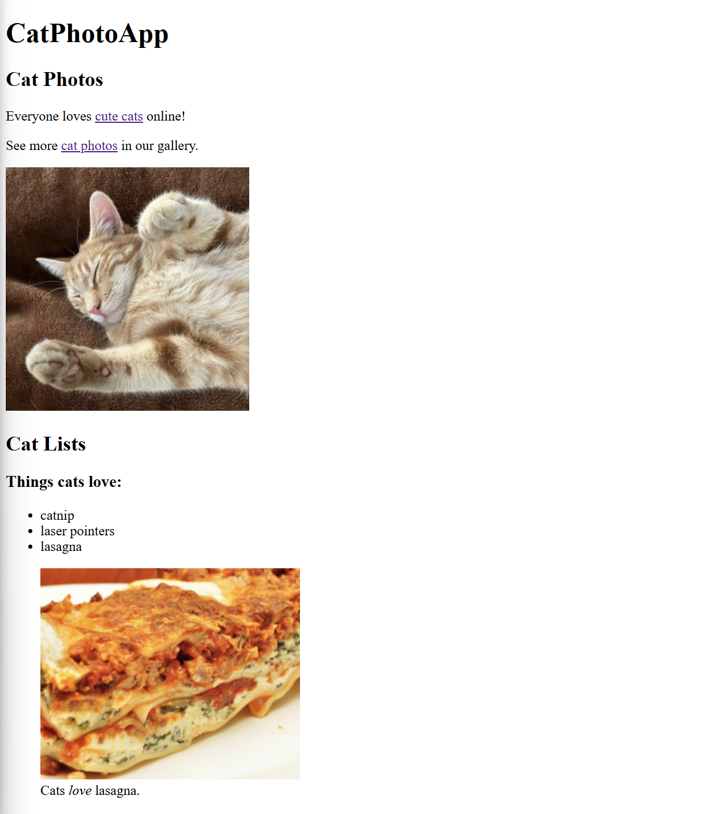

# cat-website

A simple, responsive webpage built for cat-lovers.

**Live Demo:** [https://oendemann.github.io/cat-website/](https://oendemann.github.io/cat-website/)

---

---

## About The Project

This project was a result of a guided responsive web design course on freeCodeCamp.org.

---

## Built With

* **HTML5:** Used for the structure and content of the webpage.

---

## What I Learned

1. There is a lot more that goes into web development than what it may seem like on the surface.
2. HTML5 wasn't as complicated to use as I imagined. It seems like a pretty organized language and uses a fairly easy-to-follow structure.

---

## Acknowledgments

* Project idea and requirements from [freeCodeCamp.org](https://www.freecodecamp.org/learn)